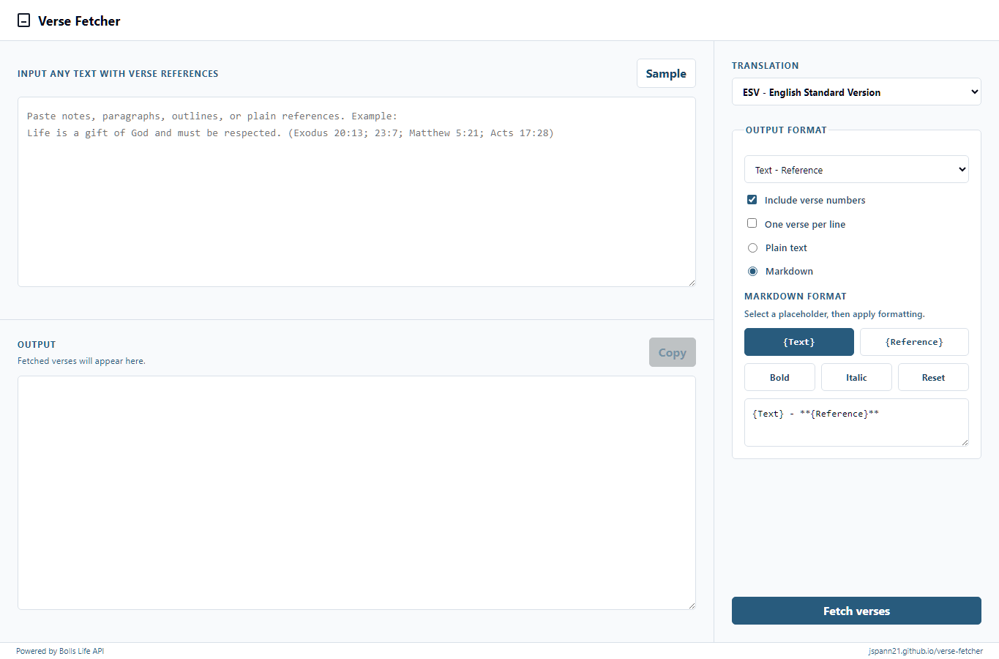

# Verse Fetcher

Paste any text with Bible references. Get only the verse text back.

[Open Verse Fetcher](https://jspann21.github.io/verse-fetcher/)



## What It Does

Verse Fetcher extracts Bible references from messy, normal writing and fetches the matching verse text.

You can paste a paragraph like this:

```text
We believe that God is the author of life and death.
The direct taking of an innocent human life is a moral evil,
regardless of intention. Life is a gift of God and must be
respected from fertilization to natural death. (Exodus 20:13; 23:7;
Matthew 5:21; Acts 17:28)
```

Verse Fetcher ignores the surrounding prose and returns only the verses:

```text
Exodus 20:13 - "You shall not murder.

Exodus 23:7 - Keep far from a false charge, and do not kill the innocent and righteous...

Matthew 5:21 - "You have heard that it was said to those of old...

Acts 17:28 - for "'In him we live and move and have our being'...
```

## Built For Flexible Input

Paste almost anything:

- Sermon notes
- Doctrinal statements
- Articles
- Bullet lists
- Comma-separated references
- Newline-separated references
- Parenthetical references inside paragraphs

It understands common formats like:

```text
John 3:16
Rom 8:28
Romans 8:28
2Tim 3:16-17
2 Ti 3:16
2 Timothy 3:16
Ps 23:1-3, 6
John:3:16
Rmns 12:1
```

## Output Options

Choose how copied verses should be formatted:

- `Text - Reference`
- `Reference - Text`
- `Text \n Reference`
- `Reference \n Text`
- Markdown quote block
- Plain text or Markdown
- Include or remove verse numbers
- Paragraph format or one verse per line

Markdown output can also be customized with `{Text}` and `{Reference}` placeholders.

## Translations

Choose from the most common English translations, including ESV, LSB, NASB, NIV, KJV, and more.

## Powered By Bolls Life

Verse text is fetched from the Bolls Life API after you submit the input. Verse Fetcher uses Bolls endpoints for:

- Translation metadata
- Batch verse fetching
- Chapter fetching when a whole chapter is requested

API documentation: [Bolls Bible API.md](https://github.com/Bolls-Bible/bain/blob/master/docs/API.md)
